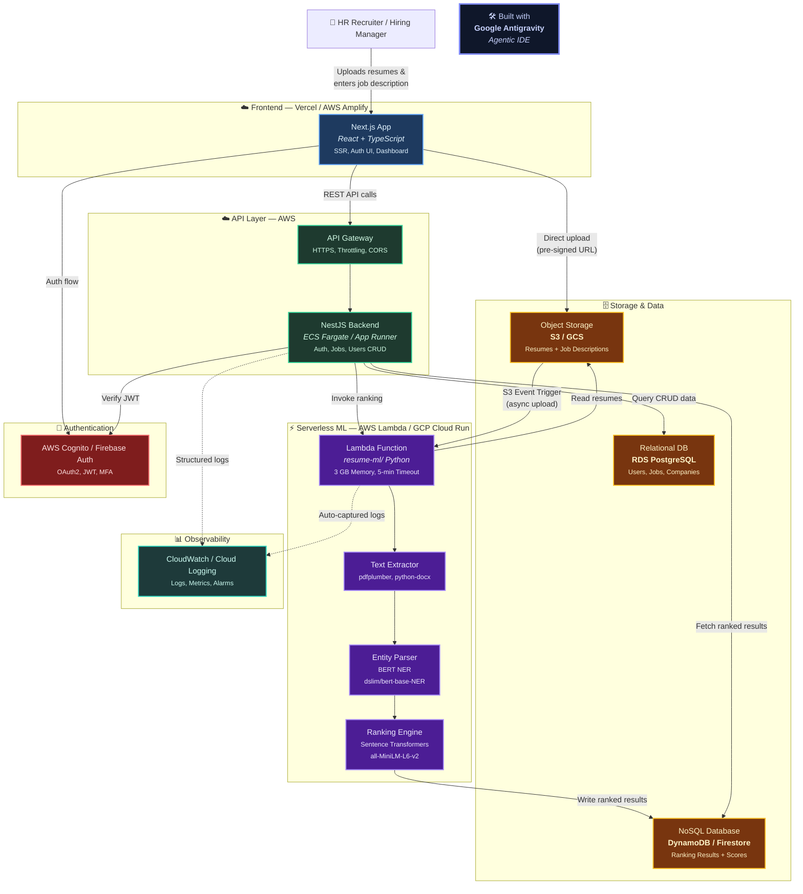

# TalentScope — Cloud-Native Architecture

> **Built with [Google Antigravity](https://github.com/google-deepmind) Agentic IDE**

---

## System Architecture (Mermaid)

---

## Cloud Benefits for Resume Screening

1. **Elastic Scalability** — During campus hiring season, 500 resumes may arrive in an hour. Lambda auto-scales from 0→500 concurrent executions with zero configuration. Off-season, it scales back to 0 and costs nothing.

2. **Pay-Per-Use Economics** — ML inference (Sentence Transformers + BERT NER) is expensive but infrequent. Lambda bills per 1ms of compute: processing 100 resumes/day costs ~$0.50/month vs. ~$50/month for an always-on EC2 instance running the same model.

3. **Separation of Concerns** — Each component is independently deployable and scalable: the Next.js frontend on Vercel, the NestJS API on Fargate, the ML pipeline on Lambda, and data in managed services (S3, DynamoDB, RDS). Teams can work on each layer without affecting others.

4. **Durability & Reliability** — S3 provides 99.999999999% (11 nines) durability for resume files. DynamoDB replicates data across 3 availability zones. No resume ever gets "lost on someone's laptop."

5. **Security by Default** — S3 encryption at rest, IAM least-privilege roles, API Gateway throttling, Cognito JWT verification — all managed by AWS. No manual SSL certificate rotation or firewall rules.

6. **Zero Ops Overhead** — No server provisioning, no OS patching, no disk capacity monitoring. The ML model runs inside a Docker container on Lambda; AWS handles the underlying infrastructure lifecycle.

---

## Architecture Decision Record (ADR)

### ADR-001: Serverless Architecture for ML Resume Ranking

| Field | Value |
|---|---|
| **Status** | Accepted |
| **Date** | 2026-03-09 |
| **Decision Makers** | TalentScope Engineering Team |

#### Context

TalentScope's ML ranking pipeline uses Sentence Transformers (`all-MiniLM-L6-v2`) and BERT NER (`dslim/bert-base-NER`) to score resumes against job descriptions. The pipeline is:
- **CPU/Memory intensive** — each resume requires ~300ms of ML inference at 3 GB memory.
- **Bursty** — usage spikes during hiring campaigns and drops to near-zero otherwise.
- **Stateless** — each ranking request is independent (no session state, no inter-request dependencies).

#### Decision

**Use AWS Lambda (container image) for the ML ranking pipeline** instead of always-on servers (EC2/ECS).

#### Alternatives Considered

| Option | Pros | Cons |
|---|---|---|
| **EC2 Instance (always-on)** | Simple deployment, full control | Pays 24/7 even when idle; manual scaling; OS patching |
| **ECS Fargate (always-on)** | Managed containers, auto-scaling | Still pays for min. running tasks; slower scale-to-zero |
| **AWS Lambda (serverless)** ✅ | True pay-per-use; auto-scales 0→1000; zero ops | Cold starts (~3-5s); 15-min timeout; 10 GB memory max |
| **GCP Cloud Run** | Container-based; 60-min timeout; scale-to-zero | GCP vendor lock-in; less mature ML ecosystem |

#### Rationale

1. **Cost**: At 100 resumes/day, Lambda costs ~$0.50/month. An equivalent EC2 `t3.xlarge` (4 vCPU, 16 GB — minimum for ML models) costs ~$120/month. Lambda is **240× cheaper** at this scale.

2. **Scaling**: Lambda handles bursts natively. A campus hiring event uploading 1,000 resumes triggers 1,000 parallel Lambda invocations — no pre-provisioning, no capacity planning.

3. **Operational burden**: Lambda eliminates server management entirely. No AMI updates, no Docker daemon monitoring, no disk space alerts. The team can focus on ML model quality instead of infrastructure.

4. **Cold starts** (the main concern): Mitigated by using Docker container images with pre-baked models (see `Dockerfile` + `deploy_lambda.sh`). Provisioned Concurrency can be enabled for latency-sensitive endpoints at ~$15/month for 1 warm instance.

5. **Stateless design**: The existing codebase already follows stateless patterns (see `ranker.py`, `extractor.py`) — functions take bytes in and return JSON out. No refactoring needed for Lambda.

#### Consequences

- **Positive**: Dramatically lower costs, automatic scaling, zero operational overhead.
- **Negative**: Cold starts add 3-5 seconds on first request after idle period; must use container images (ZIP limit is 250 MB, too small for ML models); 15-minute timeout limits batch sizes to ~2,500 resumes per invocation.
- **Mitigations**: Provisioned Concurrency for latency-critical paths; SQS + fan-out pattern for batches exceeding 2,500 resumes.
