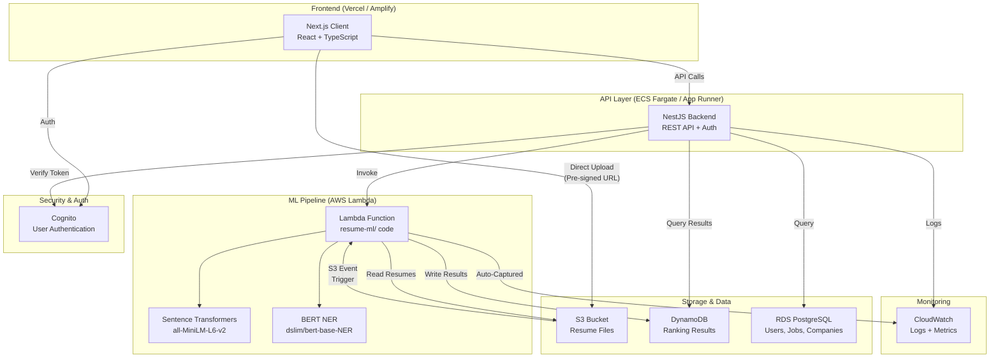

# TalentScope — Cloud Service Mapping

This document maps each TalentScope project component to its recommended cloud service equivalent, showing how the local development architecture translates to a production cloud deployment.

## Component-to-Cloud Mapping

| Component | Current (Local) | AWS Suggestion | GCP Alternative | Key Benefit |
|---|---|---|---|---|
| **Resume Storage** | Multipart upload → NestJS backend handles files in memory | **S3** with versioning, encryption, lifecycle rules | Cloud Storage | Unlimited scale, 11-nines durability, $0.023/GB/month |
| **ML Ranking** | Flask server (`app.py`) running locally on port 5000 | **Lambda** (container image via ECR, 3 GB memory) | Cloud Run | Pay-per-use, auto-scales 0→1000, zero server management |
| **Backend API** | NestJS dev server on localhost:3001 | **ECS Fargate** or **App Runner** | Cloud Run / GKE | Managed containers, auto-scaling, no EC2 instances to manage |
| **Frontend** | Next.js dev server on localhost:3000 | **Amplify Hosting** or **CloudFront + S3** (static export) | Firebase Hosting / Vercel | Global CDN, automatic HTTPS, CI/CD from Git |
| **Database** | In-memory stubs (`*.service.ts`) — no persistence | **RDS PostgreSQL** (Supabase-compatible) or **DynamoDB** | Cloud SQL / Firestore | Managed, auto-backups, point-in-time recovery |
| **Authentication** | Not yet integrated | **Cognito** (user pools + federated identity) | Firebase Auth | Managed auth, OAuth2/OIDC, MFA, free tier = 50K MAU |
| **Parsed Results** | Returned as HTTP JSON response (ephemeral) | **DynamoDB** with TTL for auto-cleanup | Firestore | Serverless NoSQL, single-digit ms latency, pay-per-request |
| **Logging / Monitoring** | Console output (stdout) | **CloudWatch** Logs + Alarms + Dashboards | Cloud Logging / Monitoring | Auto-captured from Lambda, structured query support |
| **CI/CD Pipeline** | Manual deployment | **CodePipeline** + **CodeBuild** or GitHub Actions → AWS | Cloud Build | Automated build, test, deploy on every Git push |

## Architecture Diagram

## Cost Estimate (Small Scale — 100 resumes/day)

| Service | Monthly Usage | Estimated Cost |
|---|---|---|
| **S3** | ~500 MB storage, 3K requests | ~$0.02 |
| **Lambda** | 3,000 invocations × 5s × 3 GB | ~$0.75 (within free tier) |
| **DynamoDB** | 3,000 writes, 10,000 reads | ~$0.01 |
| **API Gateway** | 10,000 API calls | ~$0.04 |
| **CloudWatch** | 5 GB logs | ~$2.50 |
| **RDS (db.t3.micro)** | Always-on (or use Aurora Serverless) | ~$15 (or $0 with serverless pauses) |
| **Total** | — | **~$3–18/month** |

> **Note**: AWS Free Tier covers most of these services for the first 12 months, bringing the real cost to effectively **$0** for a class project or early-stage startup.

## Deployment Order

1. **Infrastructure** → `terraform apply` or `aws cloudformation deploy` (creates S3, Lambda, DynamoDB, IAM)
2. **ML Pipeline** → Build Docker image, push to ECR, update Lambda (see `resume-ml/deploy_lambda.sh`)
3. **Backend** → Containerize NestJS, deploy to ECS Fargate or App Runner
4. **Frontend** → Connect to Vercel (auto-deploys from Git) or deploy to Amplify
5. **DNS & SSL** → Route 53 for custom domain, ACM for SSL certificate
